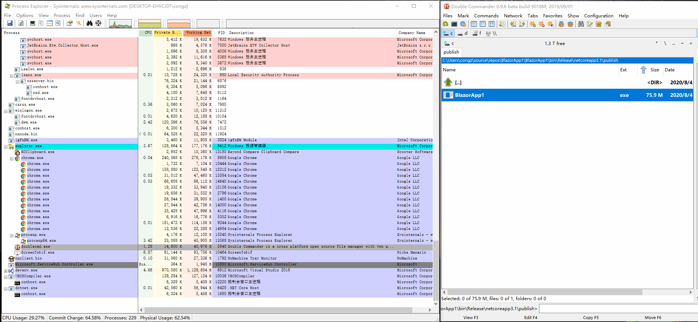

It's a really workable application, just one single standalone exe file, allow to copy and run on any windows 10 computer.

0. It will be single file standalone exe
1. It's base on .net core 3.1
2. It's a blazor server side application
3. It will open you os browser when blazor server started
4. It will exit automate when the browser tab be closed
5. No heavilly electron&node&chromium needed

It's really cool, and you can quick start to develop a windows application by .net & web technology.

Have a lot of fun!

# Demo

